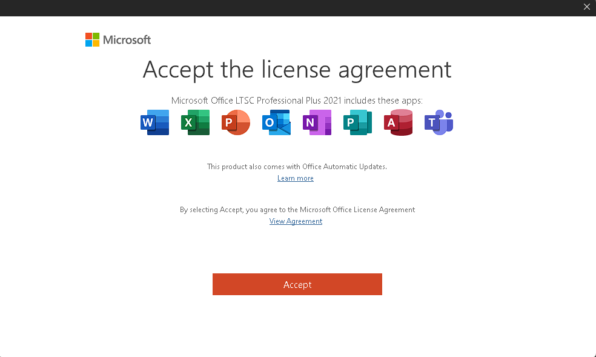

# Office 2021 is Here!

# Office 2021 Pro Plus
Download Office 2021 on GitHub, yes it's legal.
Well why is it legal? : user pulled a issue.
It is legal because of the XML and activation. The XML's are from Microsoft's official site. The XML's are really used for business's but because of this GitHub, its pretty easy for non Tech People. The activator uses KMS which is a great option in Windows and Office.

This installs and activates Office!

## Activation
I recommend running activation after 180 days or if says it is not valid.

So after its ready for activation, first install the renewal. If you are connected to internet after 180 days it will re-activate office.
Then, its the final part. Activate Office! 

# Q: How do I install?
A: So the original config *configuration-office* has project and visio removed. If you want those features, use the name from the configuration-office file and overwrite the file.
A: Assuming you have the files, you can run the bat file.

Run the bat when you are ready.

---

# Q: Can I activate on my own?
Yeah, for sure you can. That is why I did not make activation automatic. You may skip that and activate on your own.

Q: The KMS Servers are down, what servers can I use?

A: Haha, I made KMS servers a while ago.
A: Here it is: k1.4kash.org k2.codelazy.org k3.linux4kash.com

---

# Q: ~~How do I activate? It keeps saying Office activation off.~~
~~So it might be a bug, im fixing it but for now.~~

~~Go to the folder with the files, go to activate then to MAS, then go to Seperate Files Version, then to activators, go to online kms activation, then run
activate.cmd~~

It has been fixed.

# Activation P2
So after you activated, open MS Office and accept the license agreement.

--

# Your activated (skip)

Its finished.

Enjoy!
